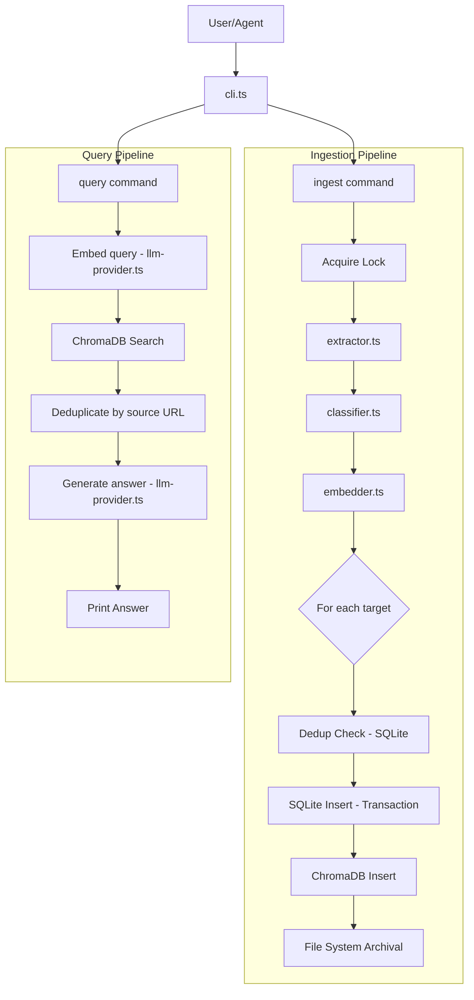

# Architecture

## Flow Diagram



### Key architectural note

Extraction and embedding happen **once** regardless of how many targets are specified. Only the storage step (SQLite + ChromaDB + file archival) runs per-target. This avoids redundant API calls.

## Components

### `src/cli.ts`
Entry point using Yargs. Defines two commands: `ingest` and `query`. Parses `--tags` and `--targets` flags and delegates to the respective module.

### `src/ingest.ts`
Orchestrates the full ingestion pipeline:
- **Locking**: Acquires a PID-based file lock (`ingest.lock`) before starting. The lock is considered stale after 15 minutes or if the owning PID is no longer running. Released in a `finally` block.
- **Target management**: Iterates over requested targets (`pablo`, `paloma`, `reels`), each with its own `repoPath`, `dbPath`, and `collectionName` defined in the `TARGETS` constant.
- **Deduplication**: Per-target check against `normalized_url` in SQLite before insertion.
- **Database transaction**: Source and chunk inserts are wrapped in a `BEGIN`/`COMMIT` transaction with `ROLLBACK` on failure.
- **File archival**: After successful DB insert, archives the original content to `{repoPath}/{SourceType}/{YYYY-MM}/{sourceId}-{sanitizedTitle}.ext`. PDFs and text files are copied; other types have their `originalContent` written to disk.

### `src/query.ts`
Handles the query flow:
1. Embeds the user's question via `llm-provider.ts`
2. Queries ChromaDB with optional tag-based `$where` filter
3. Deduplicates results by keeping only the best (closest distance) chunk per source URL
4. Constructs a prompt with retrieved context and generates an answer via `llm-provider.ts`

### `src/extractor.ts`
Responsible for extracting content from sources (URLs, PDFs, YouTube, tweets). Currently a **stub** that returns hardcoded test data — the real implementation needs to be built out.

### `src/classifier.ts`
Uses the LLM to auto-tag content. Sends a content snippet (first 5000 chars) along with existing tags from the database, and asks the LLM to return a JSON object with assigned tags, newly created tags, and reasoning. Tags are merged with any manually provided tags.

### `src/embedder.ts`
Two responsibilities:
1. **Chunking**: Splits text at sentence boundaries into ~800 character chunks with 200 character overlap. Chunks shorter than 100 chars are merged into the preceding chunk.
2. **Embedding**: Generates vector embeddings via `llm-provider.ts` in batches of 10 with 200ms delays between batches. Uses an LRU cache (1000 entries) keyed on chunk content to avoid re-embedding identical text.

### `src/vector-store.ts`
ChromaDB wrapper. Manages collection creation/retrieval (cached in a `Map`), batch insertion (100 vectors per batch), and querying. Vector IDs follow the format `chunk_{source_id}_{chunk_id}`.

Note: A dummy `OpenAIEmbeddingFunction` is passed to ChromaDB because the JS client requires an embedding function, but all embeddings are actually generated externally via `llm-provider.ts`.

### `src/llm-provider.ts`
Unified interface for all LLM operations (text generation and embeddings). Implements a fallback chain: **Gemini -> Minimax**. Provider is selected automatically based on which API keys are present in the environment. See [LLM Providers](./LLM_PROVIDERS.md) for full details.

### `src/database.ts`
SQLite connection management using the `sqlite`/`sqlite3` packages:
- Connections are cached by absolute path in a `Map` to avoid duplicate handles.
- WAL mode and foreign key constraints are enabled on connection.
- Provides `initializeSchema()` for creating `sources` and `chunks` tables with indexes.
- Provides `getAllUniqueTags()` for collecting all existing tags across sources (used by the classifier).

### `src/config.ts`
Loads environment variables via `dotenv` from the project root. Exports a `config` object with API keys, database path, collection name, and model identifiers. Tries loading `.env` from `__dirname/../../.env` first (works from both `src/` and `dist/`), then falls back to CWD.

## Directory Structure (Runtime)

```
personal-rag-kb/              # This project
  src/                         # TypeScript source
  dist/                        # Compiled JS (gitignored)
  .env                         # API keys (gitignored)

../personal-rag-kb-storage/    # pablo target storage repo
  Article/2025-01/             # Archived articles by month
  Video/2025-01/               # Archived videos by month
  knowledge_base.db            # pablo's SQLite DB

../paloma-rag-kb-storage/      # paloma target storage repo
../instagram-reels-storage/    # reels target storage repo
```
